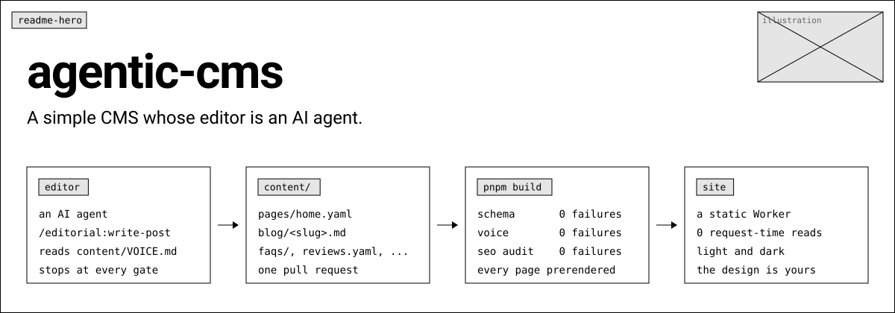
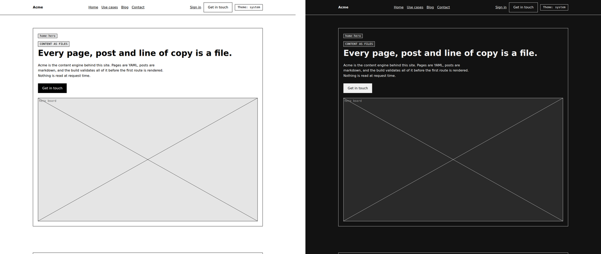
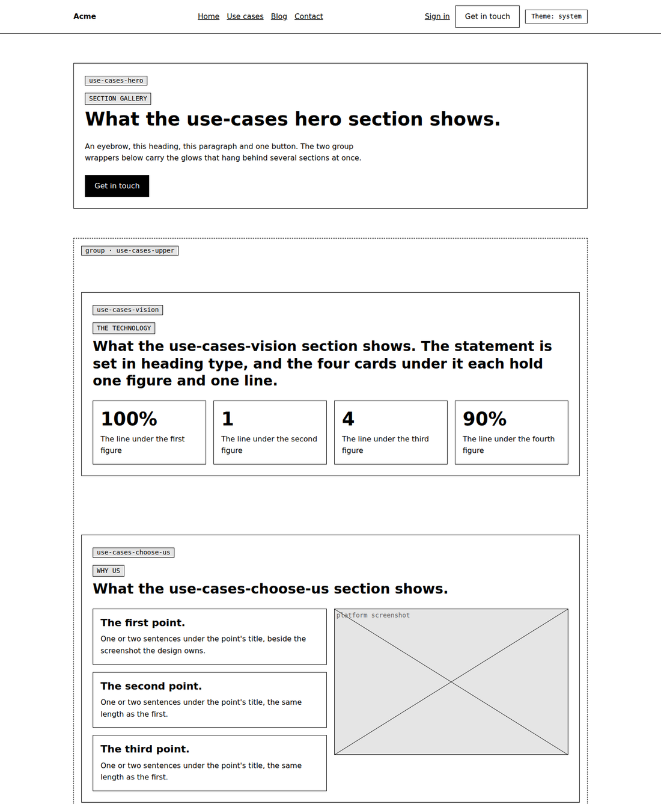
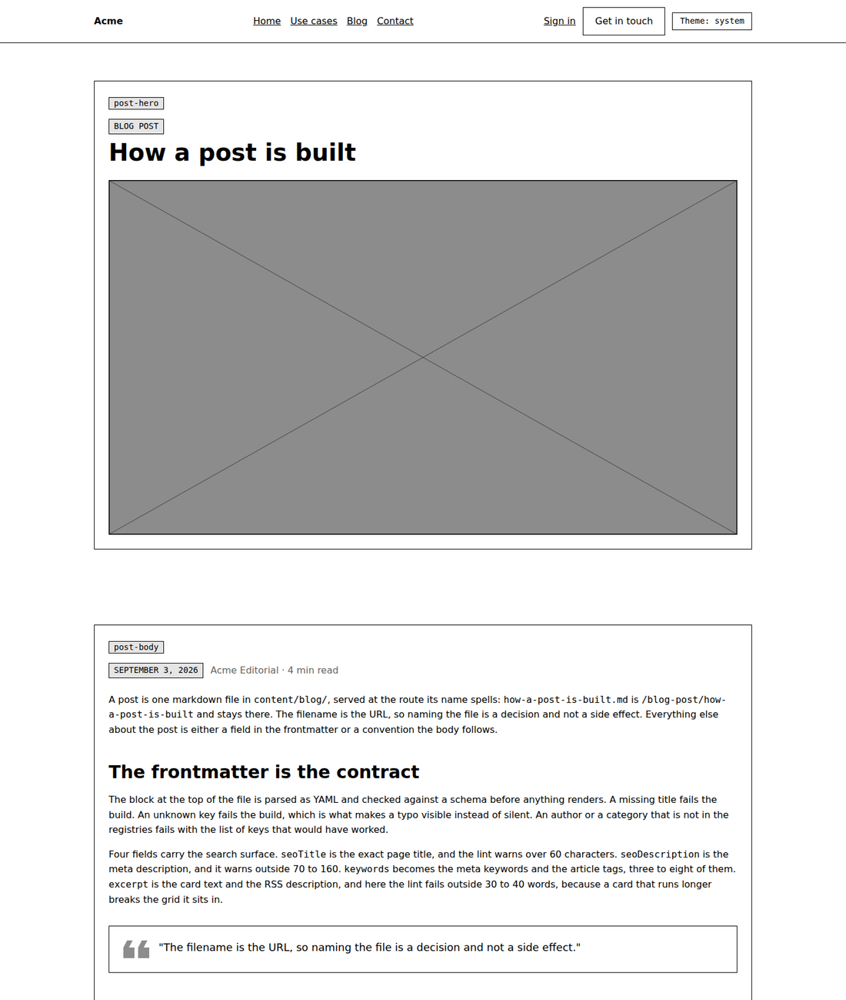
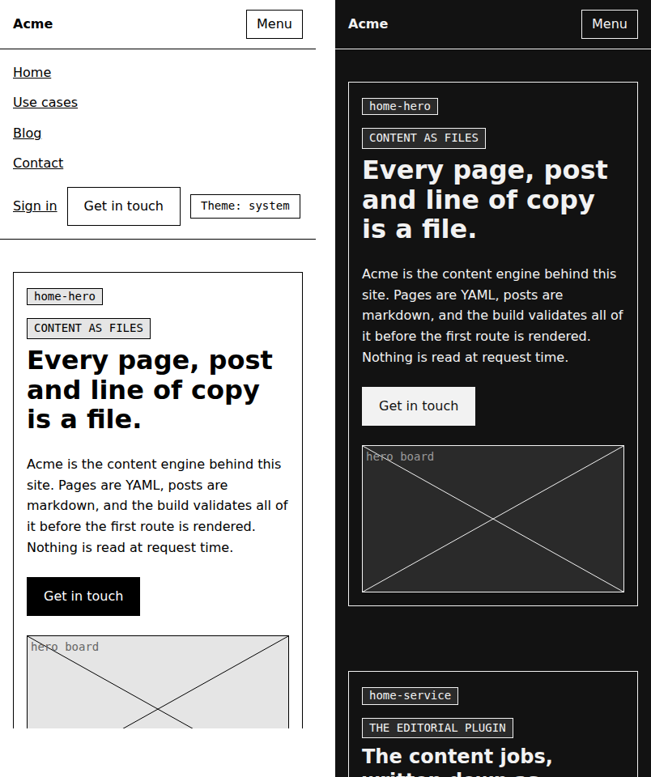

<div align="center">

<picture>
  <source media="(prefers-color-scheme: dark)" srcset="docs/readme/banner-dark.svg">
  
</picture>

**Pages, posts and every line of copy are files in a Next.js repo.**<br>
**An agent edits them. The build says no. What ships is static.**

      

[The loop](#the-loop) · [Files, not a database](#files-not-a-database) · [A page is a file](#a-page-is-a-file) · [A post is a file](#a-post-is-a-file) · [The voice is a lint](#the-voice-is-a-lint) · [The editor is an agent](#the-editor-is-an-agent) · [So is the designer](#so-is-the-designer) · [The proof is a diff](#the-proof-is-a-diff) · [Built on it](#built-on-agentic-cms) · [Start your own site](#start-your-own-site)

</div>

## The loop

**1. The agent edits a file.** The landing page is `content/pages/home.yaml`:
its SEO block, its structured data, its sections in order with all their
copy. A post is `content/blog/<slug>.md`. The `editorial` plugin gives Claude
Code and Codex the skills that write, add, update, review, retire and report
on that content, reading the site's own rules from the repo and stopping at
every gate for a person.

**2. The build says no.** Every file is parsed against its schema, every
string is read against the site's voice rules, every prerendered page is
audited for its title, description, canonical, Open Graph, headings, image
attributes, structured data and sitemap entry. Break a few things and build;
this is what it says, verbatim:

```
$ pnpm build
FAIL content/pages/home.yaml schema: sections[0].eyebrow is required
FAIL content/pages/home.yaml schema: sections[0] unknown key(s) eyebrows
FAIL content/pages/home.yaml schema: sections[2].cards must have exactly 5 cards
FAIL content/pages/home.yaml voice-banned: sections[0].cta "seamless" is banned (hype); write "say what the reader does not have to do"
FAIL content/pages/home.yaml em-dash: sections[1].heading contains an em dash; use a period, a comma, or restructure the sentence
WARN content/blog/pages-are-files.md seo-title: seoTitle is 66 characters; Google shows about 60
```

`pnpm content:lint` gives the same answer in about a second, without the build.

**3. What ships is static.** Every page is prerendered and served as a file:
from a Cloudflare Worker's asset cache, as the example is, or from a Node
server's standalone package, which `agentic-cms assemble` completes and
checks. There is no database, no admin screen and no request-time read; a
copy change is a diff, a review and a deploy.

```bash
git clone git@github.com:HKamkar/agentic-cms.git && cd agentic-cms
pnpm install
pnpm dev          # http://localhost:8000, then change a line in content/pages/home.yaml
```

<div align="center">

</div>

## Files, not a database

| | agentic-cms | A CMS with a database |
|---|---|---|
| Where the copy lives | `content/`: seven collections, one folder, one pull request per change | rows behind an admin screen |
| Who edits it | an AI agent, with a person approving each gate; or anyone with an editor | people in the admin screen |
| What stops a mistake | the build, with a line that names the file, the field and the problem | a preview, if someone looks |
| What runs at request time | nothing: prerendered, static, cached at the edge | a query per page |
| The design | yours: what ships is a wireframe a fork replaces, with the machinery kept | the theme's |
| When it is the wrong tool | copy that must change without a deploy, a search over thousands of entries, or authors who will never open a pull request | — |

## A page is a file

```yaml
# content/pages/home.yaml
seo:
  path: /
  title: "Acme: content as files, checked on every build"
  description: Acme is a CMS whose editor is an AI agent. Pages, posts and copy are files, validated at build time, prerendered, and served with no request-time reads.
  ogImage: /images/home-og.jpg
  updated: "2026-09-18"
  breadcrumb: Home
jsonld:
  type: WebPage
  application: { name: Acme, description: …, operatingSystem: Any (static site), offer: …, featureList: [ … ] }
sections:
  - type: home-hero
    eyebrow: Content as files
    heading: Every page, post and line of copy is a file.
    text: Acme is the CMS behind this site, and its editor is an AI agent. Pages are YAML, posts are markdown, and the build validates all of it before the first route is rendered.
    cta: Get in touch
  - type: home-service
    …
```

The `seo` block becomes the head, the canonical and the sitemap entry. The
`jsonld` block becomes the page's structured data (`WebPage`, `AboutPage`,
`ContactPage` or `Blog`, each with its own fields). Each `type` names one of
24 section components (a `group` nests them), and its copy schema says
exactly what the section takes; a card list has an exact length, so a fourth card is a design change
rather than a typo. Presentation stays in the component. There is no
`page.tsx` to write: one catch-all route renders every page file.

The four pages under `/sections/` are the catalogue: every section type the
landing page leaves out, rendered with copy that says what each slot is for.



## A post is a file

```yaml
---
title: Pages are files
excerpt: >-
  A page on this CMS is one YAML file with three blocks. An SEO block, a
  structured-data block and a list of sections in order. Here is what each block
  holds and what the build does with it.
date: '2026-09-09'
category: guides
author: acme-editorial
image: /images/blog/pages-are-files/pages-are-files-hero.webp
imageAlt: A wide grey placeholder standing in for the hero illustration of this post
seoTitle: Pages are files | Acme
keywords: [page as a file, YAML, section types, structured data, SEO audit]
related: [how-a-post-is-built, the-voice-file-and-the-lint]
publishedAt: '2026-09-09T09:00:00.000Z'
---
```

The filename is the URL. The body is markdown with four conventions the
renderer keys off: headings start at `##`, a `> "quote"` becomes the
pull-quote card, an image alone in its paragraph becomes the figure block,
and a `## Frequently asked questions` heading with `###` questions becomes
the accordion and the `FAQPage` structured data. The lint checks the
frontmatter's SEO limits, the heading structure, the FAQ's shape, the alt
texts and that every image exists on disk and weighs under 250 KB.



## The voice is a lint

`content/VOICE.md` says how the site writes and what it never claims. Its
fenced block is machine-readable: banned words and patterns, the brand's
spelling and mark, the words that count as claims near a regulation, model
and cloud names, the SEO ranges. `agentic-cms lint` reads it on every
build. Exact rules fail; heuristics warn. What the lint cannot judge (rhythm,
an unsupported number, a misattributed date) is what the two review agents
are for.

## The editor is an agent

`plugin/` is one plugin for Claude Code and Codex. It reads everything it
needs from the repo it stands in and carries nothing of any brand.

| Skill | Does |
|---|---|
| `/editorial:write-post` | a post from a brief in four gated stages: outline, body, the two reviews in isolation, SEO fields |
| `/editorial:new-post` | a post from a draft file, with its images and frontmatter, as `draft: true` |
| `/editorial:update-post` | an edit to a post, the two dates and the URL intact |
| `/editorial:new-page` | a page from the template, made of existing section types |
| `/editorial:retire-content` | a post hidden (its URL kept) or a page removed once a redirect exists |
| `/editorial:review-voice` | a file read against `VOICE.md` for what the lint cannot judge |
| `/editorial:critic` | a post read hard by an editor who did not watch it being written, every external claim checked against primary sources |
| `/editorial:content-status` | what is live, in draft, planned and recently changed, read-only |

The two review skills, `review-voice` and `critic` (the critic fact-checks
against primary sources), also run as Claude Code agents
`editorial:voice-reviewer` and `editorial:critic`, in isolation from the
conversation that wrote the draft. The same directory installs in Claude Code
and in Codex; the repo is its own marketplace for both, and in a checkout
Claude Code has the plugin on through `.claude/settings.json`. Elsewhere:

```bash
claude plugin marketplace add git@github.com:HKamkar/agentic-cms.git && claude plugin install editorial@agentic-cms --scope user
```

```bash
codex plugin marketplace add HKamkar/agentic-cms && codex plugin add editorial@agentic-cms
```

`plugin/README.md` is the contract: what a site offers the plugin, what the
skills write, and the optional workshop file for marketing that lives outside
the repo.

## So is the designer

A site's look is designed the same way its copy is edited: by an agent,
one element at a time, with the owner picking at every gate. The design
skills ship in the repo (`.claude/skills/`, `.agents/skills/`, found by
Claude Code and Codex with nothing installed), and every one of them works
through the command line, so what a round leaves behind is files and a
proof, never a tool in the reader's browser.

| Skill | What it does, and the commands under it |
|---|---|
| `design` | a site from the wireframe to a look of its own: tokens first, then the chrome, then the sections |
| `design-options` | a design round: three to five ideas, the picked ones built as real components on a throwaway route in the section's own frame with the page's copy (`pnpm kit demo new`), the owner picks by letter; `demo clean` then removes everything the round created that the winner does not use, and says what it keeps and why |
| `design-graphics` | the site's own drawings as SVG in the lab (`pnpm kit lab`): scenes on the site's tokens in both schemes, at the sizes they ship and on a phone, a timeline to step through a loop, rendered to the file a page ships; a loop that should play when it is seen goes inline (`InlineAnimation`, `readInlineSvg`) |
| `design-icons` | icons as families: the inventory of every icon beside its copy (`icons audit`), Lucide and Simple Icons maps (`icons add`), marks from primitives (`icons family`), and a round for a set of the site's own (`icons round new / publish / retire`) |
| `design-measure` | a screenshot claim turned into numbers before an edit: an element's box, styles and stacking chain (`probe`), a crop (`shot`), candidates at their real size on their real grounds (`sheet`) |
| `design-proof` | the change proven on the pixels (below) |

[docs/design.md](docs/design.md) is the loop, [docs/lab.md](docs/lab.md)
the lab, [docs/icons.md](docs/icons.md) the icons,
[docs/shot-probe-sheet.md](docs/shot-probe-sheet.md) the one-shot commands.

## The proof is a diff

A refactor must not move a pixel, and a design change must move only the
pixels it meant to. `agentic-cms visual-parity` photographs every page of
the production build at eight widths, in either colour scheme, and diffs two
captures pixel by pixel:

```bash
pnpm kit visual-parity capture before --ref develop   # the baseline: that commit built in a sibling worktree and captured
pnpm kit visual-parity capture after --build          # this tree, built and copied first, so it is free while the capture runs
pnpm kit visual-parity compare before after           # exit 1 on any difference, one line per file
```

The rendering is made deterministic before a shot is taken: reduced
motion, frozen transitions, every reveal at its end state, every image
loaded, every inline SVG animation held at its rest frame. `--motion` plays
the animations and photographs each scroll step mid-flight and settled,
with an inventory of every animation; `--states` photographs hover, focus,
checked and open. A compare line says what changed and where: `SIZE …
shift` when one section grew and pushed the page down, and a `cause:` line
naming the section and its height change, down to a fraction of a pixel.
[docs/visual-parity.md](docs/visual-parity.md) is the contract.

## The wireframe you replace



Four colours, each a `light-dark()` pair (`paper`, `ink`, `fill`, `muted`);
a system font stack; no radius, shadow or motion; a theme switch that follows
the system until a reader picks. Every section renders in a box that prints
its own YAML type, so the page and the page file read side by side.
Illustrations are crossed placeholder boxes; content images come from
`pnpm kit placeholder <out> <width> <height>` until real ones exist.
`STANDARD.md` is the design system; `src/components/README.md` the catalogue.
The `agentic-cms/ix` library stays in the package for a fork that wants
motion: scroll-into-view reveals and sequences, and `InlineAnimation`, a
site's own SVG loop that plays in view and rests for a reader who prefers
reduced motion.

## Built on agentic-cms


[deeplit®](https://deeplit.ai), private AI infrastructure from Delft, is
the first site on the package. Its design — the sections, the chrome, the
CSS modules, the images, the reveals and sequences on `agentic-cms/ix`, the
icons drawn in design rounds, the loop on its Platform page — its content
and its config live in its own repo; the engines, the libraries and the
command line come from here by tag (`github:HKamkar/agentic-cms#v0.5.3`),
composed once in its `src/kit.ts`, and it runs as a Node server from the
standalone package `agentic-cms assemble` completes. Same page files, same
post pipeline, same lint and audit as the wireframe above; the design is the
part a site brings.

## Start your own site

Two ways, one result. **Fork** this repo when you want the example around
you — the wireframe, the section galleries, the posts that describe it —
and replace it piece by piece. **Install** the package when your site is its
own repo, as deeplit's above is, and let it lay the site out:

```bash
mkdir my-site && cd my-site && pnpm init
pnpm add agentic-cms@github:HKamkar/agentic-cms#v0.5.3      # allowBuilds below, first
pnpm exec agentic-cms init .                                # the site: the example, the agent files, the config
pnpm install && pnpm dev
```

A git dependency builds its `dist/` on install (`prepare`), which pnpm runs
only when `pnpm-workspace.yaml` allows it:

```yaml
allowBuilds:
  "agentic-cms@git+https://github.com/HKamkar/agentic-cms.git": true
  sharp: true
```

Either way the site carries, from the first session and with nothing
installed, what an agent needs to design it: the rules (`AGENTS.md`,
`.claude/rules/`), the design skills (`.claude/skills/`, `.agents/skills/`
— `design`, `design-options`, `design-measure`, `design-icons`,
`design-graphics`, `design-proof`) and the commands they call. [docs/init.md](docs/init.md) is what `init` writes and
what comes next; [docs/design.md](docs/design.md) is the loop.

<details>
<summary><b>Then: the six steps</b></summary>

1. Forking: rename the package and the plugin marketplace to your own name,
   and drop the Cloudflare files if you host elsewhere. Installing: `init`
   wrote `src/kit.ts`, where your site composes the engine — the one file
   the app and the command line read (server code only):

   ```ts
   import { createKit } from "agentic-cms";
   import { sectionSchema } from "@/components/sections/schemas";
   import { site } from "@/config/site";
   export const kit = createKit({ site, sections: sectionSchema });
   // kit.collections · kit.content (getPages, getPage, getFaq, …) · kit.blog (getAllPosts, getRelatedPosts, …)
   // kit.seo (pageMetadata, pageJsonLd, postMetadata, sitemap, feed, robots, …) · kit.urls (postUrl, absoluteUrl) · kit.site
   ```

   and `package.json` names the commands: `"content:lint": "agentic-cms
   lint"`, `"content:check"`, `"content:status"`, `"content:docs"`, `"kit":
   "agentic-cms"`, `"build": "agentic-cms lint && agentic-cms docs --check
   && next build && agentic-cms seo"`, and for the site's own tests
   `"test": "node --import agentic-cms/loader --test \"src/**/*.test.ts\""`.
2. `src/config/site.ts`: the brand, the URL, the e-mail and address, the nav,
   the footer, the calls to action (data only, `satisfies SiteConfig`).
3. `src/app/globals.css`: the tokens — or start the `design` skill, which
   begins there. Both themes follow from the `light-dark()` pairs.
4. Copy `content/_templates/VOICE.md` to `content/VOICE.md` and write your
   rules; the prose and the fenced block say the same thing.
5. Replace the content: the registries, the reviews, the FAQ sets, the use
   cases, the page files, the posts. `content/README.md` is the door;
   `content/_templates/` has an annotated template per collection. Keep or
   delete the `/sections/*` demo pages.
6. `pnpm content:lint` until clean, `pnpm build`, then the host of your
   choice: the example's Cloudflare Worker, or a Node server
   ([docs/deploy.md](docs/deploy.md): `output: "standalone"` and
   `agentic-cms assemble` as the build's last step).

</details>

A new kind of section is a copy schema, a component and a registry entry
(`src/components/sections/`). A collection of your own is a schema and a
definition returned from `createKit`'s `collections` option
(`src/lib/content/README.md`). A new form is an entry in `src/config/forms.ts`.
## Upgrading

A site pins the package by tag. An upgrade is the new tag, `pnpm install`,
`pnpm exec agentic-cms init . --agent-files` (the new rules and skills in,
the site's own edits kept), the steps of that release in
[docs/upgrading.md](docs/upgrading.md), then `pnpm build` and a new
baseline for the screenshot harness. `CHANGELOG.md` says what changed and
marks every change to what a capture writes.

## Commands

```bash
pnpm dev             # next dev on :8000
pnpm build           # content lint → docs check → next build → SEO audit; every page prerendered
pnpm preview         # build for Cloudflare and serve the Worker locally on :8000
pnpm run deploy      # build for Cloudflare and deploy (pnpm wrangler login first)
pnpm test            # the engine's, the post pipeline's and the lint's node:test suites, about a second
pnpm test:browser    # the Chromium-backed suite (the harness's library; skips, naming the fix, without a browser)
pnpm test:pack       # packs the package and builds a scratch site from the tarball, the way a site that installs it does
pnpm hygiene         # the public repo's hygiene: no one site's name, no machine paths, no captures committed, docs current
pnpm content:lint    # the content rules, about a second
pnpm content:status  # what is live, in draft and planned, from the files
pnpm content:docs    # the field tables into content/README.md
pnpm kit <command>   # the command line: placeholder, optimize-webp, optimize-svg-rasters, parity, visual-parity, seo, …
pnpm kit shot|probe|sheet   # a section's picture with its box, the numbers behind a screenshot claim, a candidate sheet
pnpm kit demo <new|clean>   # the design round's throwaway route: candidates for a section in its frame with the page's copy, on the site's theme, the current version last
pnpm kit init <dir>  # a site from the package: the example, the agent files, the config
pnpm kit guard-email # fails a build whose served files carry the site's e-mail address as text
pnpm kit assemble    # a standalone build packaged for a Node host: public/ and .next/static copied in, every file checked
pnpm kit icons <add|remove|family|audit|round>   # a site's icon map from Lucide, Simple Icons and its own drawings, a family of marks from primitives, the inventory, a design round for its own
pnpm kit lab <new|serve|route|render|clean>   # the design canvas: SVG scenes on the site's tokens, on a phone, and as a throwaway route on the site's theme; rendered to the files a page ships; removed after
pnpm kit --help      # every command; <command> --help prints its flags and exit codes
```

Every command's flags, defaults and exit codes are in
[docs/commands.md](docs/commands.md) (generated from the specs the parser
reads, so it is the contract); the screenshot harness has its own guide,
[docs/visual-parity.md](docs/visual-parity.md), and the one-shot page
commands theirs, [docs/shot-probe-sheet.md](docs/shot-probe-sheet.md);
[docs/](docs/README.md) is the index.

- Node 22.18+ (`.nvmrc` says 26) and pnpm. The build fetches nothing: no
  webfont, no external data.
- `light-dark()` wants a current browser (Chromium 123+, Safari 17.5+,
  Firefox 120+).
- The Worker is static-only: OpenNext's static-assets cache serves the
  prerendered pages, and only `preview`, `deploy` and `upload` populate it, so
  `wrangler dev` straight after `next build` returns 500s. The ~40 "Failed to
  copy node_modules/…" lines during the OpenNext build are an OpenNext bug and
  harmless.
- `agentic-cms visual-parity` screenshots every page at eight widths, in
  either colour scheme, and diffs two captures pixel by pixel: the proof for
  a refactor that must not move anything.

## Going live

1. Pick a form service for the contact form; it ships on the `mailto`
   backend (`src/config/forms.ts`, `src/lib/forms/README.md`).
2. If the site replaces an existing one, recreate its redirects before the
   DNS change (on the Worker, or in `next.config`'s `redirects()` on a Node
   server). A public URL never changes without one.
3. `pnpm build`, `pnpm preview`, click through every page in both themes.
4. On the example's Cloudflare Worker: `pnpm run deploy`. On a Node server:
   the build ends with `agentic-cms assemble`, and `.next/standalone` is the
   package (`node server.js`; [docs/deploy.md](docs/deploy.md)).
5. Attach the domain, verify `/`, a post and `/sitemap.xml`; submit the
   sitemap.

## Map

```
content/pages/<slug>.yaml    every page: seo, jsonld, sections
content/blog/<slug>.md       posts (slug = filename); _template.md is the annotated template
content/authors.json         content/categories.json   content/reviews.yaml   content/faqs/<key>.yaml   content/use-cases.yaml
content/VOICE.md             the voice and claim rules; _templates/VOICE.md is the blank
content/editorial/           calendar.md, backlog.md, and workshop.yaml when marketing lives elsewhere
plugin/                      the editorial plugin: skills/, agents/, README.md (its contract)
.claude/skills/, .agents/skills/   the design skills, for Claude Code and Codex, found from a checkout with nothing installed
templates/site/              what init writes into a site: AGENTS.md, the rules, the config; templates/lab-demo/ the lab's route
src/lib/                     the package (agentic-cms): content/, blog/, seo/, forms/, ix/, components/, lab/, email, cx, createKit
src/kit.ts                   the example composing the package for itself; the file every site has
src/components/sections/     the section registry and the copy schemas
src/components/ui/           Section, Placeholder, Button, Navbar, Footer, Faq, ThemeToggle, the form primitives
src/config/site.ts           the brand, URLs, nav, footer, calls to action
bin/, scripts/               the command line: lint, check, status, docs, seo, guard-email, assemble, placeholder, the optimisers, parity, visual-parity, shot, probe, sheet, icons, lab, demo, init
STANDARD.md                  the design system     AGENTS.md   the rules for any agent working on the code (CLAUDE.md includes it)
PLAN.md                      how the engine was built, condensed     CHANGELOG.md   every release
docs/                        the guides: commands.md, visual-parity.md, shot-probe-sheet.md, design.md, skills.md, init.md, upgrading.md, deploy.md, icons.md, lab.md, email.md, roadmap.md
```

MIT licensed.
